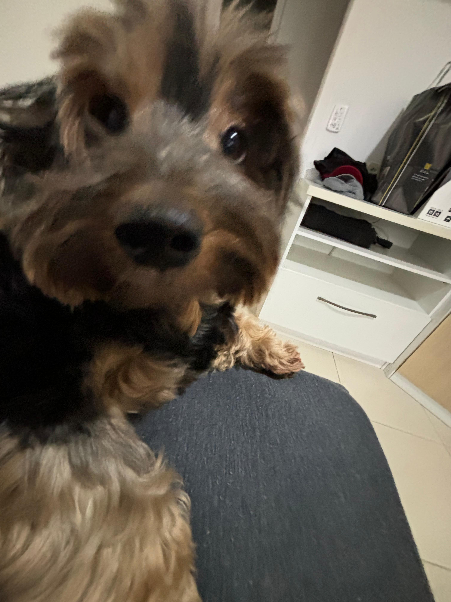

## 💻 Guilherme Piñon

👋 Olá! Seja bem-vindo(a) ao meu GitHub.
Sou estudante de Engenharia de Software, atualmente morando no Rio de Janeiro. Estou em busca de oportunidades que me permitam aprender coisas novas, ganhar experiência na prática e evoluir como desenvolvedor.

## 🐶 Meu Cachorro

<h3 align="left">Linguagens e Tecnologias:</h3>

          

## 📫 Entre em contato comigo:

